# Azure Machine Learning

## Titanic Survival

Today, we’re going to create a model to predict who would have lived (and died) during the sinking of the titanic. 

### Modeling

1.  We're now going to upload your saved CSV file as a dataset in Azure Machine Learning.

2.  Navigate to the [Azure Machine Learning Studio](http://studio.azureml.net) and log in.  (If you run into any issues, try opening an inprivate browser session.)

3.  On the bottom left, click the plus sign, and choose **DATASET** -> **FROM LOCAL FILE**.  

    
    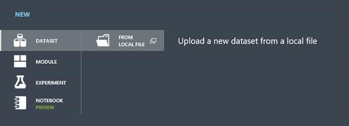

4.  Upload your new dataset, naming it appropriately, for example: "Titanic Dataset".  Hit the check mark when you've filled out the form to upload the data.

    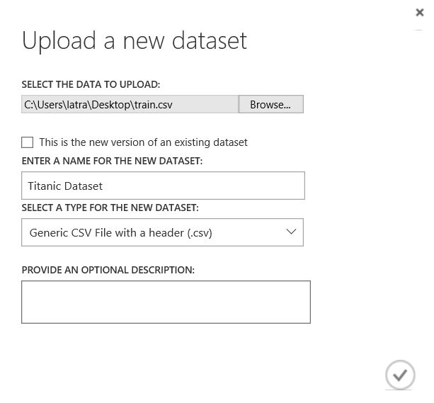

5.  Next we'll create a new experiment from the same + symbol in the bottom left. Choose **Blank experiment** and rename it appropriately. 

    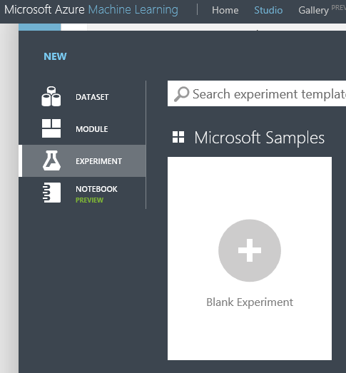

6.  Drag your newly added dataset to the Azure ML experiment canvas.  Your dataset is on the left pane under **Saved Datasets**

    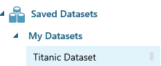

7.  We need to choose the features that we want to include in our model.  Add the **Select Columns in Dataset** module.

    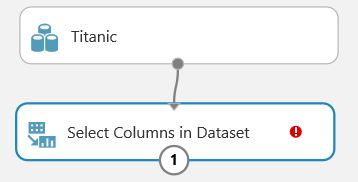

    With the module highlighted, click **Launch Column Selector** on the right pane

    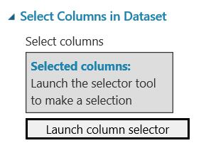

    There are certain columns we want to exclude.  Choose the **WITH RULES** pane on the left, choose Begin With **ALL COLUMNS** and select **Exclude** from the first drop down.  Exclude the columns shown below.  Feel free to exclude others as well, leaving the columns that you think will be predictive of survival.

    Why would we want to exclude these columns?

    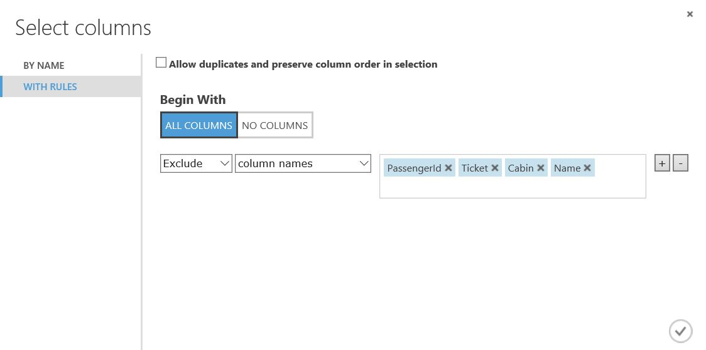

8.  Next, we need to clean out pieces of the dataset where we have missing data.  Drag in the **Clean Missing Data** module, and configure the options as shown below.

    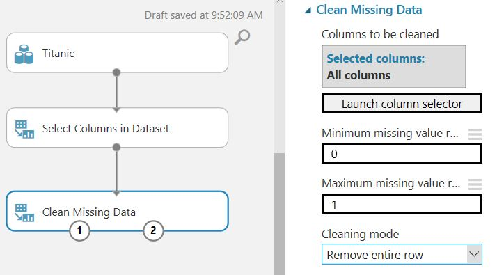

9.  Click the **Run** button at the bottom pane to ensure you get green check marks at each module and don't have any errors.

    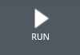

10.  The **Edit Metadata** module allows you to modify the data type of your features.  In our dataset, for example, **Pclass** is numerical, but we actually want Azure ML to treat the data a categorical.  Any ideas why?

     Drag in the **Edit Metadata** module, and specify the options below.

     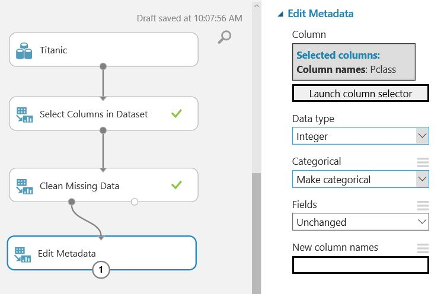

11.  We've finished preprocessing the data and are now ready to split our data into a training set and a test set.  The **training set** is the data that our algorithm will learn from.  The **test set** is the data we withhold so that we can test how well our model performs on new data is has not seen yet.

     Drag in the **Split Data** module, and configure it with 70% of the data for training (leaving 30% for testing).

     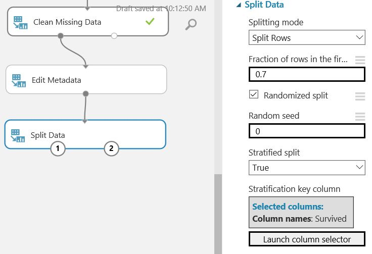

     Turning on **Stratified Split** will tell Azure ML to evenly split data according to our column of choice.  We want to evenly split the data according to the **label** that we want to predict: **Survived**.  

12.  Next use the **Train Model** module, so drag that out as well, connecting the training dataset (left output of **Split Data**) into **Train Model**. Don't forget to select the column that we are trying to predict (the dependent variable).

     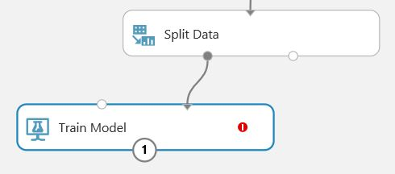

13.  We know we're trying to solve a ____________________ problem, so we will add an algorithm from the _______________ drop down. Any will do to start!  Add it into your experiment.

     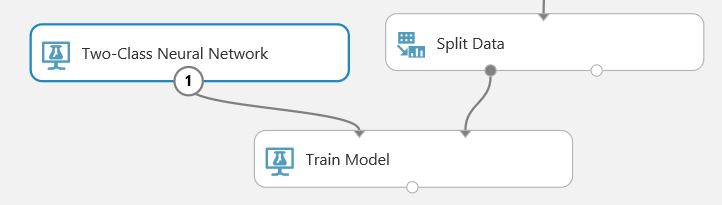

14.  Add a **Score Model** module and connect the **Train Model** output to the top left node. Connect your test data, the 30% split, to the top right node of the **Score Model** module.

     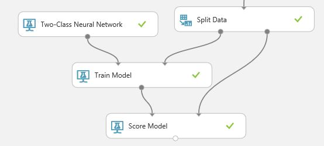

15.  Now recreate this structure (steps 12-14), reusing the data from the **Split Module** to train and score using another classification algorithm.

16.  Finally, let's see how our two models perform!  Take the output of both **Score Model** modules and connect them to the two input nodes in the **Evaluate Model** module. 

17.  At this point your canvas should look similar to the one below.

     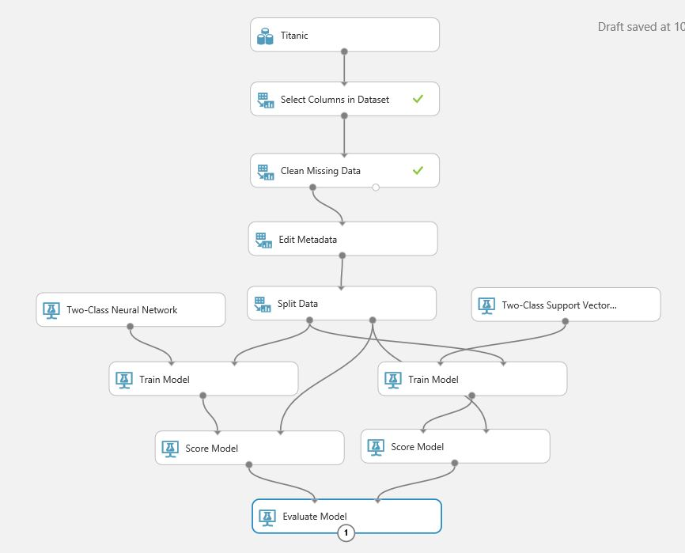

18.  Press the **Run** button, and wait for the model to finish running. Once it is finished, click the output node of the **Evaluate Model** module, and click visualize to see how accurate your model is! Keep trying other algorithms until you are happy with your results.  

### Additional Resources

- To learn how to deploy your model to an API endpoint, see [Deploy Web Service](https://docs.microsoft.com/en-us/azure/machine-learning/studio/walkthrough-5-publish-web-service)
- [Azure Machine Learning Documentation](https://docs.microsoft.com/en-us/azure/machine-learning/studio/)
